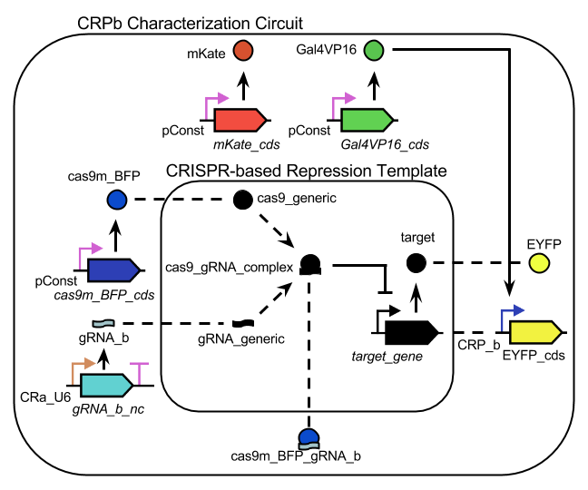

libSBOL 2.0.1
======================================

[libSBOL](https://github.com/SynBioDex/libSBOL) is a C++ library for reading, writing, and constructing genetic designs according to the standardized specifications of the [Synthetic Biology Open Language (SBOL)](http://www.sbolstandard.org/).  
USE CASE
========


**Illustration of a hierarchical CRISPR-based repression module represented in SBOL 2.0 (adapted from Figure~1a in [this paper from *Nature Methods*](http://www.nature.com/nmeth/journal/v11/n7/full/nmeth.2969.html) by Kiani, *et al*. The inner Module consists of a CRISPR Repression Circuit that combines a Cas9 protein with a gRNA to form a complex (represented by the dashed arrows) that permanently inactivates a target gene by excising its promoter (represented by the arc with the T-shaped head).   The outer Module is a 3-color Characterization Circuit that expresses blue, yellow, and red fluorescent proteins. The characterization module is coupled to the characterization module in to produce a visual read of the state of the cell. Red is a control signal that calibrates the blue and yellow signals in relation to the bioenergetic state of the cell under different metabolic loads. The dashed lines connecting Modules show how FunctionalComponents in one Module correspond or map to FunctionalComponents in another.**

CODE EXAMPLE
============
For the full code, see CRISPR_example.py

```c++
#define BASE_URI "sys-bio.org"
#define RAPTOR_STATIC

#include "sbol.h"

#include <iostream>
#include <vector>

using namespace std;
using namespace sbol;

int main()
{
	Document& doc = *new Document();

    std::string v = "1.0.0";  // Versioning uses Maven semantics
    
	// Here we use CamelCase for displayID's, to distinguish Definitions from instances
    ModuleDefinition& CRISPRTemplate = *new ModuleDefinition(BASE_URI, "CRISPRTemplate", v);
    ModuleDefinition& CRPbCircuit = *new ModuleDefinition(BASE_URI, "CRPbCircuit", v);

    // Components in the CRISPR Template
    ComponentDefinition& Cas9 = *new ComponentDefinition(BASE_URI, "Cas9", v, BIOPAX_PROTEIN);
    ComponentDefinition& GuideRNA = *new ComponentDefinition(BASE_URI, "GuideRNA", v, BIOPAX_RNA);
	ComponentDefinition& Cas9GuideRNAComplex = *new ComponentDefinition(BASE_URI, "Cas9-GuideRNAComplex", v, BIOPAX_COMPLEX);
	ComponentDefinition& TargetPromoter = *new ComponentDefinition(BASE_URI, "TargetPromoter", v, BIOPAX_DNA);
    ComponentDefinition& TargetGene = *new ComponentDefinition(BASE_URI, "TargetGene", v, BIOPAX_DNA);
    ComponentDefinition& TargetProtein = *new ComponentDefinition(BASE_URI, "TargetProtein", v, BIOPAX_PROTEIN);

    // Start the CRPb Characterization Module
    // For simplicity, only components that interface with the CRISPRTemplate Module are defined here.  For now, the rest of the module is treated like a black box
    // Components in the CRPb Characterization Module
    ComponentDefinition& Cas9mBFP = *new ComponentDefinition(BASE_URI, "Cas9-mBFP", v, BIOPAX_PROTEIN);  // This is an output of the Module
    ComponentDefinition& GuideRNAb = *new ComponentDefinition(BASE_URI, "GuideRNAb", v, BIOPAX_RNA);  // This is an output of the Module
    ComponentDefinition& Cas9mBFPGuideRNAComplex = *new ComponentDefinition(BASE_URI, "Cas9mBFPGuideRNAComplex", v, BIOPAX_RNA);
    ComponentDefinition& CRPbPromoter = *new ComponentDefinition(BASE_URI, "CRPbPromoter", v, BIOPAX_DNA);
    ComponentDefinition& EYFPGene = *new ComponentDefinition(BASE_URI, "EYFPGene", v, BIOPAX_DNA);
    ComponentDefinition& EYFP = *new ComponentDefinition(BASE_URI, "EYFP", v, BIOPAX_PROTEIN);  // This is the input of the Module
    
    doc.add<ModuleDefinition>(CRISPRTemplate);
    doc.add<ComponentDefinition>(Cas9);
    doc.add<ComponentDefinition>(GuideRNA);
    doc.add<ComponentDefinition>(Cas9GuideRNAComplex);
    doc.add<ComponentDefinition>(TargetPromoter);
    doc.add<ComponentDefinition>(TargetGene);
    doc.add<ComponentDefinition>(TargetProtein);
 
    doc.add<ModuleDefinition>(CRPbCircuit);
    doc.add<ComponentDefinition>(Cas9mBFP);
    doc.add<ComponentDefinition>(GuideRNAb);
    doc.add<ComponentDefinition>(Cas9mBFPGuideRNAComplex);
    doc.add<ComponentDefinition>(CRPbPromoter);
    doc.add<ComponentDefinition>(EYFPGene);
    doc.add<ComponentDefinition>(EYFP);
    
    // Instantiate Modules
    Module& crispr_template = *new Module(BASE_URI, "crispr_template", v, "sys-bio.org/ModuleDefinition/CRISPRTemplate/1.0.0");
    CRISPRTemplate.modules.add(crispr_template);
                                     
    Module& crpb_circuit = *new Module(BASE_URI, "crpb_circuit", v, "sys-bio.org/ModuleDefinition/CRPbPromoter/1.0.0");
    CRPbCircuit.modules.add(crpb_circuit);

    // Define the Components at the interface of the two Modules
    FunctionalComponent& cas9 = *new FunctionalComponent(BASE_URI, "cas9", v, "sys-bio.org/ComponentDefinition/Cas9/1.0.0", SBOL_ACCESS_PUBLIC, SBOL_DIRECTION_IN);
    FunctionalComponent& guide_rna = *new FunctionalComponent(BASE_URI, "guide_rna", v, GuideRNA.identity.get(), SBOL_ACCESS_PUBLIC, SBOL_DIRECTION_IN);
    FunctionalComponent& target_protein = *new FunctionalComponent(BASE_URI, "target_protein", v, TargetProtein.identity.get(), SBOL_ACCESS_PUBLIC, SBOL_DIRECTION_OUT);

    FunctionalComponent& cas9_mbfp = *new FunctionalComponent(BASE_URI, "cas9_mbfp", v, Cas9mBFP.identity.get(), SBOL_ACCESS_PUBLIC, SBOL_DIRECTION_OUT);
    FunctionalComponent& guide_rna_b = *new FunctionalComponent(BASE_URI, "guide_rna_b", v, GuideRNAb.identity.get(), SBOL_ACCESS_PUBLIC, SBOL_DIRECTION_OUT);
    FunctionalComponent& eyfp = *new FunctionalComponent(BASE_URI, "eyfp", v, EYFP.identity.get(), SBOL_ACCESS_PUBLIC, SBOL_DIRECTION_OUT);

    // Connect the modules
    MapsTo& cas9_input = *new MapsTo(BASE_URI, "cas9_input", v, cas9.identity.get(), cas9_mbfp.identity.get(), SBOL_REFINEMENT_USE_REMOTE);
    MapsTo& guide_rna_input = *new MapsTo(BASE_URI, "guide_rna_input", v, guide_rna.identity.get(), guide_rna_b.identity.get(), SBOL_REFINEMENT_USE_REMOTE);
    MapsTo& eyfp_output = *new MapsTo(BASE_URI, "eyfp_output", v, target_protein.identity.get(), eyfp.identity.get(), SBOL_REFINEMENT_USE_REMOTE);

    crispr_template.mapsTos.add(cas9_input);
    crispr_template.mapsTos.add(guide_rna_input);
    crispr_template.mapsTos.add(eyfp_output);
    
    // The crispr_template and crpb_circuit modules are now connected!  Note that the modules are essentially black boxes at this point -- we haven't described their internal workings yet!
    
    // Define the inner workings of the CRISPR_Template ModuleDefinition.  The Module contains two interactions, one for complex formation and the other for gene expression.
    // We'll start with complex formation...
    Interaction& Cas9ComplexFormation = *new Interaction(BASE_URI, "complex_formation", v, SBO_NONCOVALENT_BINDING);
    Interaction& CRISPRRepression = *new Interaction(BASE_URI, "gene_inhibition", v, SBO_INHIBITION);
    Interaction& TargetProduction = *new Interaction(BASE_URI, "target_production", v, SBO_GENETIC_PRODUCTION);

    CRISPRTemplate.interactions.add(Cas9ComplexFormation);
    CRISPRTemplate.interactions.add(CRISPRRepression);
    CRISPRTemplate.interactions.add(TargetProduction);

    // Here we represent complex formation as the reaction A + B = AB
	Participation& A = *new Participation(BASE_URI, "A", v, "sys-bio.org/FunctionalComponent/cas9/1.0.0");
	Participation& B = *new Participation(BASE_URI, "B", v, "sys-bio.org/FunctionalComponent/guide_rna/1.0.0");
	Participation& AB = *new Participation(BASE_URI, "AB", v, "sys-bio.org/FunctionalComponent/cas9-guide_rna_complex/1.0.0"); // Note that this FunctionalComponent hasn't been created yet!
    A.roles.set( SBO_REACTANT );
    B.roles.set( SBO_REACTANT );
    AB.roles.set( SBO_PRODUCT );
    
    Cas9ComplexFormation.participations.add(A);
	Cas9ComplexFormation.participations.add(B);
	Cas9ComplexFormation.participations.add(AB);

    // Here we define gene expression
    FunctionalComponent& target_promoter = *new FunctionalComponent(BASE_URI, "target_promoter", v, TargetPromoter.identity.get(), SBOL_ACCESS_PRIVATE, SBOL_DIRECTION_NONE);
    FunctionalComponent& cas9_grna_complex = *new FunctionalComponent(BASE_URI, "cas9_grna_complex", v, Cas9GuideRNAComplex.identity.get(), SBOL_ACCESS_PRIVATE, SBOL_DIRECTION_NONE );
    
	TargetProduction.participations.create(BASE_URI, "TargetProduction/promoter", v);  // The create method is general and not specialized for every class like libSBOLj's.
    TargetProduction.participations.create(BASE_URI, "TargetProduction/gene", v);
    TargetProduction.participations.create(BASE_URI, "TargetProduction/gene_product", v);
    
    // Child objects (corresponding to black diamonds in UML) can be accessed by uri
    TargetProduction.participations[ "sys-bio.org/Participation/TargetProduction/promoter/1.0.0" ].roles.set(SBO_PROMOTER);
    TargetProduction.participations[ "sys-bio.org/Participation/TargetProduction/gene/1.0.0" ].roles.set(SBO_PROMOTER);
    TargetProduction.participations[ "sys-bio.org/Participation/TargetProduction/gene_product/1.0.0" ].roles.set(SBO_PRODUCT);

    // Child objects can be dereferenced by numerical index, too.
    TargetProduction.participations[ 0 ].participant.setReference(BASE_URI, "target_promoter");
    TargetProduction.participations[ 1 ].participant.setReference(BASE_URI, "target_gene");
    TargetProduction.participations[ 2 ].participant.setReference(BASE_URI, "target_protein");
	
    CRISPRRepression.participations.create(BASE_URI, "CRISPRRepression/inhibitor", v );
    CRISPRRepression.participations.create(BASE_URI, "CRISPRRepression/promoter", v );

    CRISPRRepression.participations["sys-bio.org/Participation/CRISPRRepression/inhibitor/1.0.0"].roles.set( SBO_INHIBITOR );
    CRISPRRepression.participations["sys-bio.org/Participation/CRISPRRepression/inhibitor/1.0.0"].participant.set( cas9_grna_complex ); // This syntax allows the user to set a reference using an object. This achieves the same end results as setReference

    CRISPRRepression.participations["sys-bio.org/Participation/CRISPRRepression/promoter/1.0.0"].roles.set( SBO_PROMOTER );
    CRISPRRepression.participations["sys-bio.org/Participation/CRISPRRepression/promoter/1.0.0"].participant.set( target_promoter );

    // Iterate through objects (black diamond properties in UML)
    for( auto i_p = Cas9ComplexFormation.participations.begin(); i_p != Cas9ComplexFormation.participations.end(); i_p++)
    {
        Participation& p = (*i_p);
        cout << p.identity.get() << endl;
        cout << p.roles.get() << endl;
    }
    
    // Iterate through references (white diamond properties in UML)
    AB.roles.add(SBO "0000253");  // Appends the synonymous SBO term "non-covalent complex" to the list of roles for this Participation
    for (auto i_role = AB.roles.begin(); i_role != AB.roles.end(); i_role++)
    {
        string role = *i_role;
        cout << role << endl;
    }
    
    // Specify the order of abstract genetic components using SequenceConstraints
    TargetPromoter.sequenceConstraints.create(BASE_URI, "0", v);
    TargetPromoter.sequenceConstraints[0].subject.setReference( BASE_URI, "TargetPromoter", v );
    TargetPromoter.sequenceConstraints[0].object.setReference( BASE_URI, "TargetGene", v );
    TargetPromoter.sequenceConstraints[0].restriction.set( SBOL_RESTRICTION_PRECEDES );
    
    // CRPbCircuit Module
    Sequence& CRPbPromoterSeq = *new Sequence(BASE_URI, "CRPbPromoterSeq", v, "GCTCCGAATTTCTCGACAGATCTCATGTGATTACGCCAAGCTACGGGCGGAGTACTGTCCTCCGAGCGGAGTACTGTCCTCCGAGCGGAGTACTGTCCTCCGAGCGGAGTACTGTCCTCCGAGCGGAGTTCTGTCCTCCGAGCGGAGACTCTAGATACCTCATCAGGAACATGTTGGAATTCTAGGCGTGTACGGTGGGAGGCCTATATAAGCAGAGCTCGTTTAGTGAACCGTCAGATCGCCTCGAGTACCTCATCAGGAACATGTTGGATCCAATTCGACC", SBOL_ENCODING_IUPAC);
    CRPbPromoter.sequence.set( CRPbPromoterSeq );  // Set reference to Sequences.  Sequences are automatically added to the Document.  Careful though!  If the parent ComponentDefinition isn't already attached to a Document, the Sequence can't be added either
    
    EYFPGene.sequence.set(*new Sequence(BASE_URI, "EYFPSequence", v, "atggtgagcaagggcgaggagctgttcaccggggtggtgcccatcctggtcgagctggacggcgacgtaaacggccacaagttcagcgtgtccggcgagggcgagggcgatgccacctacggcaagctgaccctgaagttcatctgcaccaccggcaagctgcccgtgccctggcccaccctcgtgaccaccttcggctacggcctgcaatgcttcgcccgctaccccgaccacatgaagctgcacgacttcttcaagtccgccatgcccgaaggctacgtccaggagcgcaccatcttcttcaaggacgacggcaactacaagacccgcgccgaggtgaagttcgagggcgacaccctggtgaaccgcatcgagctgaagggcatcgacttcaaggaggacggcaacatcctggggcacaagctggagtacaactacaacagccacaacgtctatatcatggccgacaagcagaagaacggcatcaaggtgaacttcaagatccgccacaacatcgaggacggcagcgtgcagctcgccgaccactaccagcagaacacccccatcggcgacggccccgtgctgctgcccgacaaccactacctgagctaccagtccgccctgagcaaagaccccaacgagaagcgcgatcacatggtcctgctggagttcgtgaccgccgccgggatcactctcggcatggacgagctgtacaagtaataa", SBOL_ENCODING_IUPAC));
    
  doc.write("CRISPR_example.xml");
}
```

INSTALLATION
============
To compile libSBOL, you will need:
* git for downloading the source code
* CMake for generating platform-specific build instructions
* a C++ compiler, such as VisualStudio, g++, or MinGW

First, download them from the links above. Or if you're on Debian/Ubuntu this command should install /// everything:

```sudo apt-get install git cmake-qt-gui build-essential libxml2-dev```

If you want to update the documentation you also need Doxygen, and to generate the Python wrapper you need SWIG. To install them on Debian/Ubuntu:

```sudo apt-get install doxygen-gui swig```

Then, clone the repository:

```git clone git://github.com/SynBioDex/libSBOLc.git```

This will create a libSBOLc directory with the code. Next, run CMake (cmake-qt-gui on linux). For "Where is the source code" enter the path to your libSBOLc folder. "Where to build the binaries" can technically be anywhere, but it's only been tested with libSBOLc/build.

Click Configure, and choose what type of compiler you want to generate instructions for. /// All the development has been done using "default native compilers" and MinGW on Windows or Unix makefiles on Mac/Linux. CMake should also be able to generate projects for Eclipse, Visual Studio, XCode, etc. However, that will probably involve adjusting some paths.

The first time you click Configure CMake will list variables, like CMAKE_BUILD_TYPE and LIBXML2_INCLUDE_DIR, in red. That means they've been updated. To build the main SBOL library, just click Configure again until the red goes away. This is also where you set up the optional targets: examples, tests, manual, and Python wrapper. To add them check the appropriate boxes (SBOL_BUILD_EXAMPLES, for example) and then Configure again to adjust the settings. There's one other SBOL-specific option: SBOL_DEBUG_STATEMENTS will cause libSBOLc to be compiled with some extra debugging statements. A lot of other options might be visibile too; checking Grouped at the top makes things more managable. Once it's all set, click Generate to create the compiler instructions.

The last step is to cd into the libSBOL/build folder and run the compiler.

```make 
```

or

```mingw32-make.exe
```

Binaries will be generated in the libSBOL/release folder.

PLATFORMS
=========
Tested on Mac OSX Version 10.9.5 and Windows 7 Enterprise with Python 2.7.9 32 bit. Python 3 not currently supported.

DEPENDENCIES
============
Releases include precompiled binaries for libSBOL.


ACKNOWLEDGEMENTS
================

Current support for the development of libSBOL is generously provided by the NSF through the [Synthetic Biology Open Language Resource](http://www.nsf.gov/awardsearch/showAward?AWD_ID=1355909) collaborative award.
